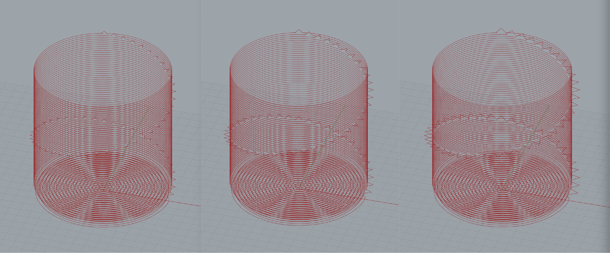

# Spiral Cup

Portfolio page: https://www.deannagelosi.com/coding-cups/

Blog post: https://medium.com/@deannagelosi/coding-clay-45ab95ee29ca

This Python library creates a spiral of geometric bumps on the exterior surface of a cup. The bump placement, size, shape are all parameters that can be modified in Rhino3D. It uses the [Extruder Turtle Library](https://handandmachine.org/projects/extruder_turtle_rhino/#euclid) which was created by the Hand and Machine Lab at UNM to define the clay 3D printer tool path.

    
    

    <b>Three tool paths in Rhino3D with side length of 2, 3, and 4mm.</b>

## Parameters

The following parameters can be modified in Grasshopper and visualized in Rhino3D to create a unique Spiral Cup:

* `radius`: the radius of the cup
* `layer_height`: the total number of layers to create the cup
* `offset`: the angular distance between bumps

For `Polygon` which can creates any n-sided shape:

* `num_sides`: the total number of sides
* `side_length`: the length of each side in millimeters

For `Triangle`, `Square`, and `Loop`:

* `bump_width`: the width of the bump
* `bump_height`: the height of the bump

Within the Grasshopper script, the `extruder_rate` and `extruder_width` can be set.